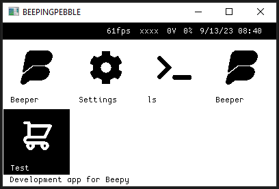

# BEEPINGPEBBLE



## About

A launcher for the beepy (formerly beepberry) with a pebble watch PebbleUI inspiration

The launcher is written in V, which is a transpiled-to-C-then-compiled-to-binary language which minimizes battery usage and increases application speed.

Features:

- [ ] load app config from text file
- [ ] launch apps
- [x] Battery status
- [x] WIFI status
- [x] Light/Dark mode
- [x] custom graphics library with custom b/w primitives and bmfont support
- [x] rasterized text to avoid anti-aliased "soft" text
- [ ] 30/60fps (currently ~60fps with 3% cpu usage on rpi zero 2)
- [ ] vsync (untested)
- [x] direct framebuffer writing
- [x] framebuffer emulation for development on windows & linux

## Developing

Dependencies: vlang installed

Emulation on Windows/Mac/Linux:

```
v -d emu run .
v -d emu -profile profile.txt -keepc -showcc run .
v -d emu -printfn blit -o ./dbg.c .
```

Dev on pi

```
v run .
```

Build for Pi (note, this has to be run raspberry pi zero hardware):

```
v -prod .
```
