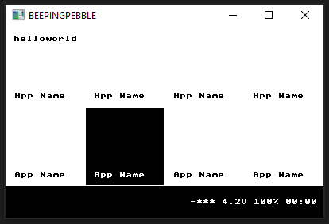

# BEEPINGPEBBLE



## Dev notes

```
thirdparty/fbg/src $ find . -name "*.o" -type f -delete

ON RPI
thirdparty/fbg/src $ gcc -c -I. -I.. -I../.. -I../../src ../src/lodepng/lodepng.c ../src/nanojpeg/nanojpeg.c ../custom_backend/fbdev/fbg_fbdev.c fbgraphics.c

ON WINDOWS
thirdparty/fbg/src $ gcc -DWITHOUT_JPEG -DWITHOUT_STB_IMAGE -c -I. -I.. -I../.. -I../../src ../src/lodepng/lodepng.c fbgraphics.c

TO CREATE V LIB HEADERS
thirdparty/fbg/src $ v translate wrapper fbgraphics.h
thirdparty/fbg/custom_backend/fbdev $ v translate wrapper ./fbg_fbdev.h
```

testing quickstart example `gcc ../src/lodepng/lodepng.c ../src/nanojpeg/nanojpeg.c ../src/fbgraphics.c .\quickstart.c -I ../src/ -I.`

move the \*.v files to `libs/fbg/c`

```
v -showcc -keepc run ./src/
```

## RPI Apps

https://github.com/k5njm/beepy-hacks

100nF hack
2.2uF hack

There are many different ways to check the battery. Stats are stored at:

```
/sys/firmware/beepy/battery_percent
/sys/firmware/beepy/battery_raw
/sys/firmware/beepy/battery_volts
```

So you can do (for example):
`cat /sys/firmware/beepy/battery_percent ; echo "%"`

## Other

```
fbset -fb /dev/fb1 -g 400 240 400 240 24 -vsync high
cat /dev/urandom >/dev/fb1
```

## Using GG

## Using SDL

https://gamedev.stackexchange.com/questions/157604/how-to-get-access-to-framebuffer-as-a-uint32-t-in-sdl2
https://wiki.libsdl.org/SDL2/MigrationGuide
https://stackoverflow.com/questions/55084655/how-to-draw-a-framebuffer-object-to-the-default-framebuffer
https://stackoverflow.com/questions/30599636/8-bit-surfaces-in-sdl-2

https://github.com/mobius3/KiWi

## RamTex https://www.ramtex.dk/products/genericbw.htm

## raylib

raygui does not have any means of keyboard navigation

https://www.raylib.com/index.html
https://github.com/raysan5/raylib/issues/1370
https://avikdas.com/2019/01/23/writing-gui-applications-on-raspberry-pi-without-x.html

regex, with capitalization
`(?<!gg_)ctx` -> dwg
`(?<!\.)Context` -> DrawContext
